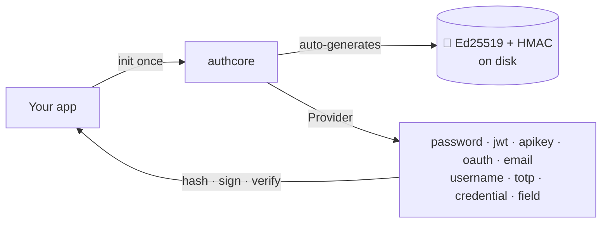

# authcore

Go authentication library: Argon2id password hashing, EdDSA access/refresh
tokens with rotation, opaque API keys, OIDC/OAuth2 social login, and
email/username validation. No database and no framework required — each
module is independent and safe by default.

[](https://github.com/Glyndor/authcore/actions/workflows/ci.yml)
[](https://pkg.go.dev/github.com/Glyndor/authcore)

License: MIT.

---

```go
// Without authcore — every line is a chance to leak or weaken something:
salt := make([]byte, 16); rand.Read(salt)               // right size? right RNG?
key := argon2.IDKey(pw, salt, 3, 64*1024, 2, 32)        // OWASP params? memorised?
stored := encodePHC(salt, key)                           // hand-rolled format…
if subtle.ConstantTimeCompare(a, b) == 1 { /* login */ } // remembered constant-time?
// …then generate Ed25519 keys, sign a JWT, hash + rotate refresh tokens, repeat.

// With authcore — secure defaults, nothing to get wrong:
hash, _ := pwd.Hash(password)                // Argon2id · salted · PHC-encoded
ok,   _ := pwd.Verify(attempt, hash)         // constant-time, always
pair, _ := tokens.CreateTokens(userID, claims) // EdDSA-signed access + refresh
```

## Install

```bash
go get github.com/Glyndor/authcore
```

Requires **Go 1.26+**. On first run, Ed25519 keys + an HMAC secret are generated
under `./.authcore/` — point `KeysDir` at a secrets volume in production.

## Quick start

```go
// One-time setup at startup. Keys are created on first run.
auth, _ := authcore.New(authcore.DefaultConfig())

pwd, _    := password.New(auth)                          // Argon2id, OWASP defaults
tokens, _ := jwt.New[UserClaims](auth, jwt.DefaultConfig())

// Register: store only the hash, never the plaintext.
hash, err := pwd.Hash("Str0ng-P@ssword!")                // err == password.ErrWeakPassword tells the user why

// Log in: verify, then mint an access + refresh pair.
if ok, _ := pwd.Verify("Str0ng-P@ssword!", hash); ok {
    pair, _ := tokens.CreateTokens(userID, UserClaims{Role: "admin"})
    // pair.AccessToken      → Authorization: Bearer …
    // pair.RefreshTokenHash → store server-side (never the raw token)
    // pair.SessionID        → UUID v7, use as your session PK
}
```

> [!TIP]
> Full, runnable versions live in [`examples/`](examples/) — `go run ./examples/jwt/`.
> Wiring into a real HTTP stack: [Fiber](examples/fiber/) · [Gin](examples/gin/).

## Design

authcore is an in-process library, not a hosted identity platform: it ships no
database and no HTTP server of its own, generates and manages its own signing
keys on first run, and each module (password, jwt, apikey, oauth, email,
username, totp, credential, field) can be used independently.

## Modules

Pick only what you need — each is independent, testable, and safe by default.

| | Module | Does |
|---|---|---|
| 🔑 | **[password](docs/password.md)** | Hash + verify. Argon2id, policy-enforced, self-describing PHC format. |
| 🎫 | **[jwt](docs/jwt.md)** | Access + refresh tokens. EdDSA / Ed25519, generic claims, rotation, optional denylist for instant revocation. |
| 📧 | **[email](docs/validation.md)** | Validate + normalize. RFC 5321/5322, optional cached DNS MX check. |
| 👤 | **[username](docs/validation.md)** | Validate + normalize. Reserved-name blocklist, character rules. |
| 🗝️ | **[apikey](docs/apikey.md)** | Opaque API keys. Generate, keyed-hash for storage, constant-time verify. |
| 🔐 | **[totp](docs/totp.md)** | TOTP / RFC 6238 second factor. Enroll, verify (with replay protection), recovery codes. |
| ✉️ | **[credential](docs/credential.md)** | Single-use tokens for password reset and account activation. Bound to a purpose and a subject, TTL enforced. |
| 🛡️ | **[field](docs/field.md)** | Column encryption. AES-256-GCM plus an HMAC blind index, so a value stays searchable by equality without being readable. |
| 🌐 | **[oauth](docs/oauth.md)** | Social login — Google, Microsoft (OIDC) and GitHub, Discord (OAuth2). Auth Code + PKCE, ID-token validation or userinfo. |


```mermaid
flowchart LR
    App["Your app"] -->|init once| Core["authcore"]
    Core -->|auto-generates| Keys[("🔑 Ed25519 + HMAC<br/>on disk")]
    Core -->|Provider| M["password · jwt · apikey · oauth · email<br/>username · totp · credential · field"]
    M -->|hash · sign · verify| App
```

## Docs

**New here? Start with the [Secure login recipe](docs/secure-login.md)** — the
step-by-step flow that turns these primitives into a login an auditor accepts.

[Secure login recipe](docs/secure-login.md) · [Password](docs/password.md) · [JWT](docs/jwt.md) · [Email & username](docs/validation.md) · [API keys](docs/apikey.md) · [TOTP](docs/totp.md) · [Credential tokens](docs/credential.md) · [Field encryption](docs/field.md) · [OIDC login](docs/oauth.md) · [Key management](docs/key-management.md) · [Configuration](docs/configuration.md) · [Testing & modules](docs/testing.md) · [Migrating from bcrypt](docs/migrating.md) · [Errors](docs/errors.md) · [FAQ](docs/faq.md) · [Versioning](docs/versioning.md)

Full API reference on [pkg.go.dev](https://pkg.go.dev/github.com/Glyndor/authcore).

## License

[MIT](LICENSE) — report vulnerabilities privately via the **Security** tab, never in a public issue.
